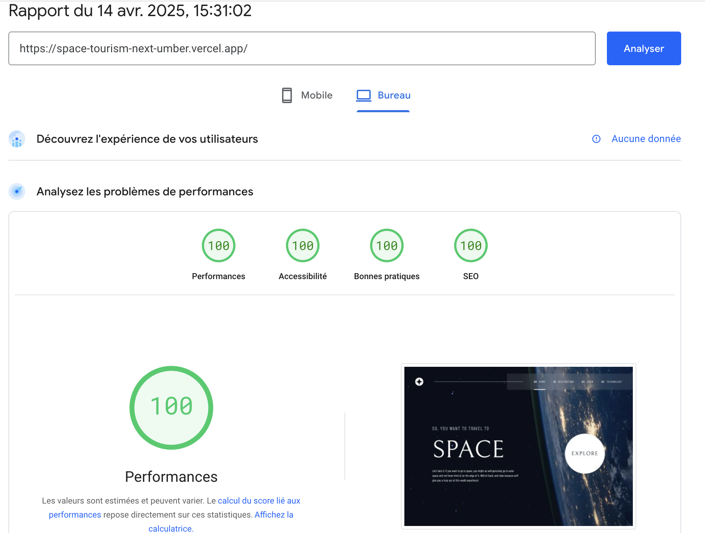
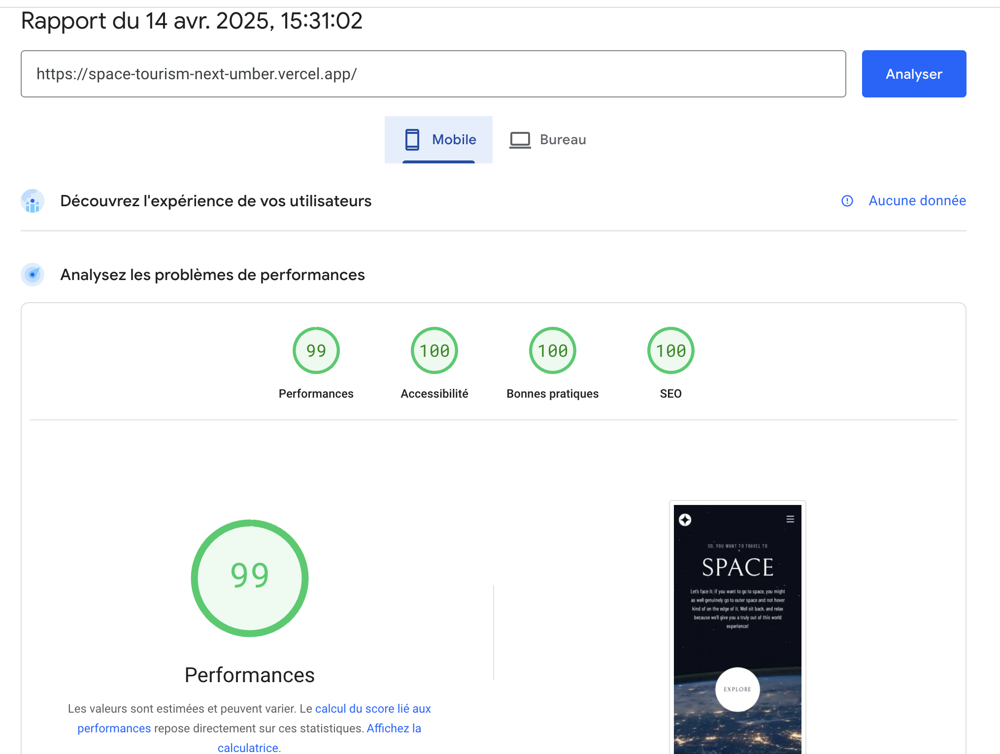
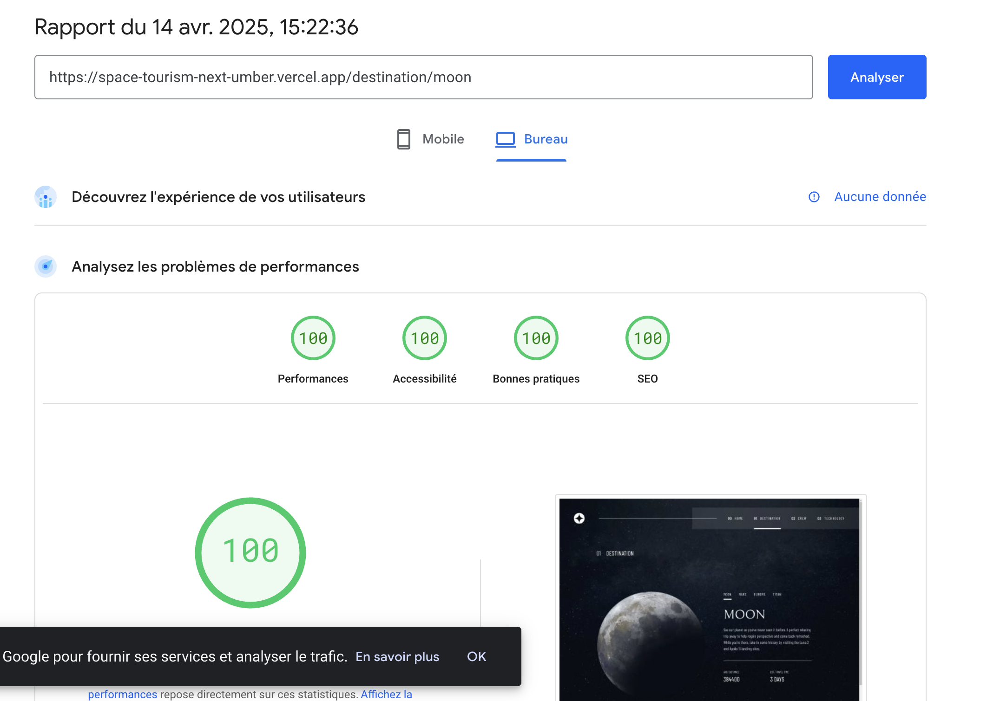
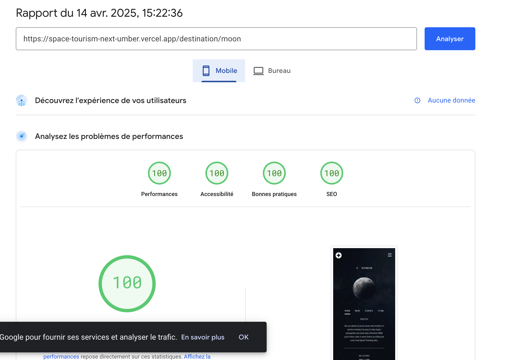
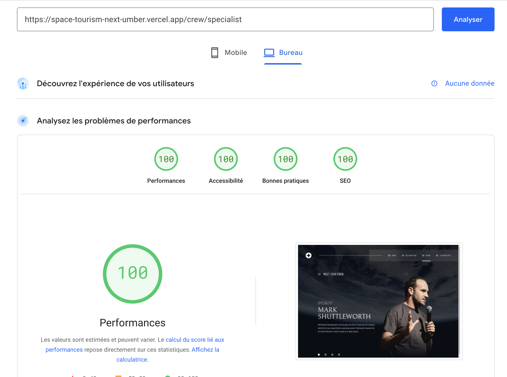
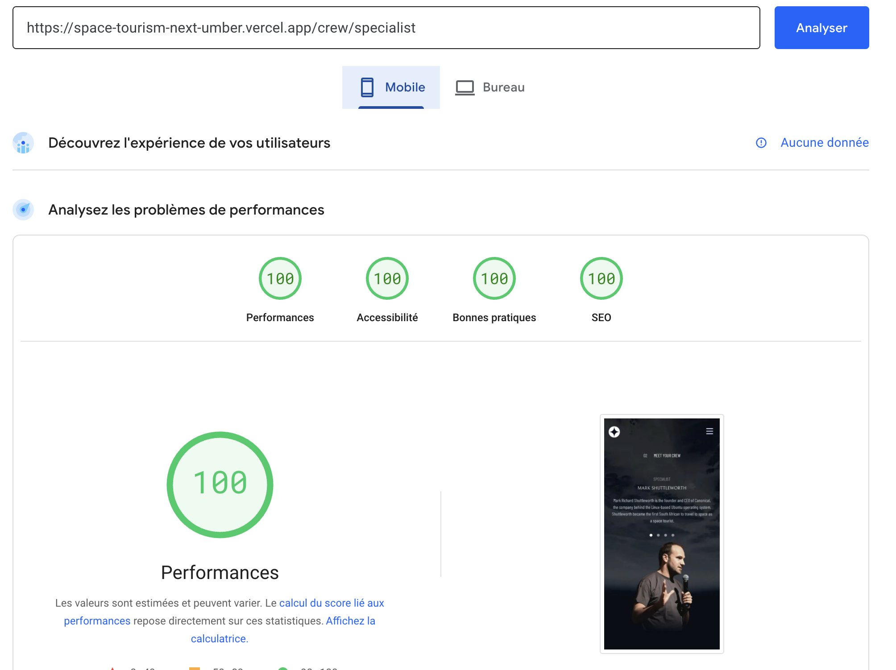
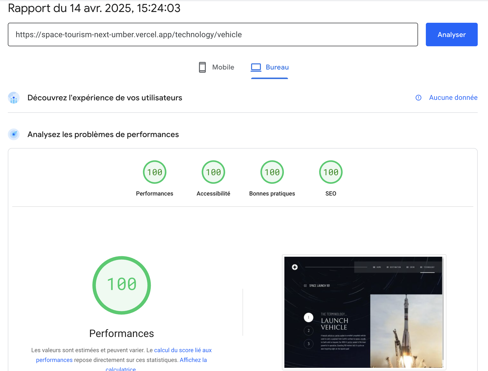
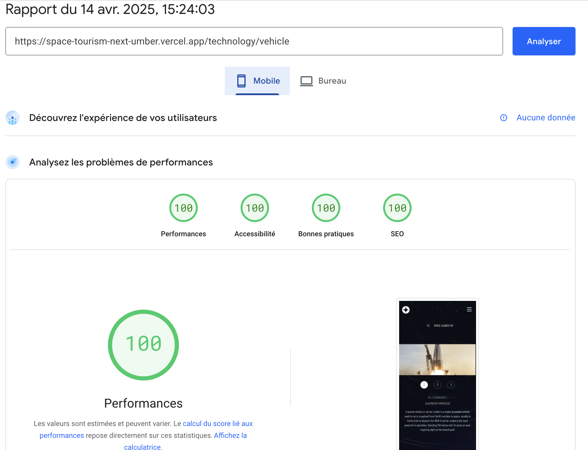

# SPACE TOURISM PROJECT

## About

The design is from frontendmentor.io. It consists on building a website with different pages. It's project I have already made before using carousel in each pages.

### The approach

This time, I decided to use a different approach: the one used by default in downloaded file from frontendmentor.io. It consists on building pages for every items in each page, instead of using a carousel as I did previously. It is translated by nested routes. I chose Next.js to practice the "app router" of Next.js.

### The stack

Languages:

- HTML/CSS
- Javascript
  Libraries/Frameworks:
- Next.js
- TailwindCSS

This is a [Next.js](https://nextjs.org) project bootstrapped with [`create-next-app`](https://nextjs.org/docs/app/api-reference/cli/create-next-app).

## Getting Started

First, run the development server:

```bash
npm run dev
# or
yarn dev
# or
pnpm dev
# or
bun dev
```

Open [http://localhost:3000](http://localhost:3000) with your browser to see the result.

## Performances

### Home page




### Destination page




### Crew page




### Technology page



